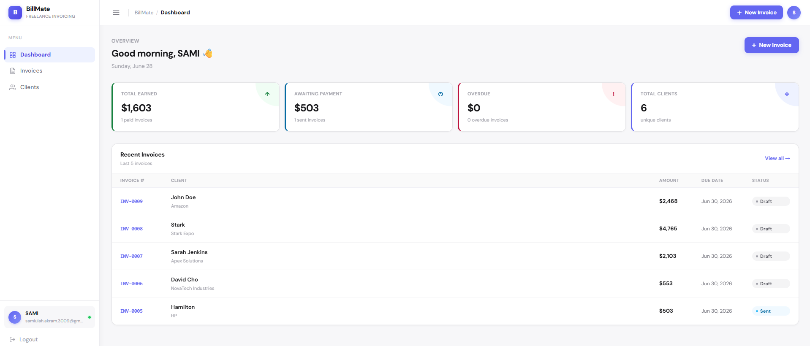

<div align="center">

# 🧾 BillMate — Freelance Invoicing SaaS

**A full-stack invoicing web app for freelancers and small businesses, built with React, Node.js, Express, TypeScript, PostgreSQL, and Prisma.**

[](https://react.dev)
[](https://nodejs.org)
[](https://supabase.com)
[](https://prisma.io)
[](https://tailwindcss.com)

</div>

---

## 📸 Preview

> *Clean light-themed SaaS dashboard — invoices, clients, and earnings at a glance*



---

## ✨ Features

- 🔐 **JWT Authentication** — secure register & login with bcrypt password hashing and protected routes
- 🧾 **Invoice Management** — create invoices with line items, auto-calculated subtotal, tax, and total
- 👥 **Client Management** — add, view, and delete clients with full contact details
- 📊 **Live Dashboard** — real-time earnings, pending, overdue stats and recent invoice activity
- 🔢 **Auto Invoice Numbers** — sequential invoice numbers generated automatically (INV-0001, INV-0002...)
- 💰 **Payment Tracking** — track invoice status across Draft, Sent, Paid, and Overdue
- 🎨 **Animated UI** — WebGL SideRays background animation and RotatingText powered by ReactBits and OGL
- 📱 **Fully Responsive** — works seamlessly on mobile, tablet, and desktop
- 🔒 **Protected Routes** — unauthenticated users cannot access dashboard pages
- ☁️ **Cloud Database** — PostgreSQL hosted on Supabase with Prisma ORM and connection pooling
- 🧾 **PDF Invoice Generator** — download any invoice as a clean, print-ready PDF, generated natively with jsPDF (no screenshots) directly from the Invoice Detail page
- 🖨️ **Print Support** — print-optimized invoice layout via the browser print dialog

---

## 🚀 Live Demo

**[→ View BillMate](https://bill-mate-three.vercel.app/login)**

---

## 🗂️ Project Structure

```text
BillMate/
│
├── client/                          # React frontend (Vite + TypeScript)
│   └── src/
│       ├── api/
│       │   └── axios.ts             # Axios instance with JWT interceptor
│       ├── components/
│       │   ├── Layout.tsx           # Sidebar + topbar wrapper
│       │   ├── ProtectedRoute.tsx   # Redirects unauthenticated users
│       │   ├── AuthRoute.tsx        # Redirects already-logged-in users
│       │   ├── RotatingText.tsx     # ReactBits text animation
│       │   └── SideRays.tsx         # WebGL background animation (OGL)
│       ├── pages/
│       │   ├── Login.tsx            # Login page
│       │   ├── Register.tsx         # Register page
│       │   ├── Dashboard.tsx        # Stats + recent invoices
│       │   ├── Clients.tsx          # Client management
│       │   ├── Invoices.tsx         # Invoice list with filters
│       │   ├── CreateInvoice.tsx    # Invoice builder with line items
│       │   └── InvoiceDetail.tsx    # Single invoice view, PDF export, print, and status actions
│       └── App.tsx                  # Route definitions
│
├── src/                             # Express backend (Node.js + TypeScript)
│   ├── controllers/
│   │   ├── authController.ts        # Register, login, getMe
│   │   ├── clientController.ts      # CRUD for clients
│   │   └── invoiceController.ts     # CRUD for invoices + line items
│   ├── middlewares/
│   │   ├── authMiddleware.ts        # JWT verification
│   │   └── validate.ts              # Zod request validation
│   ├── routes/
│   │   ├── authRoutes.ts
│   │   ├── clientRoutes.ts
│   │   └── invoiceRoutes.ts
│   ├── lib/
│   │   └── prisma.ts                # Prisma client singleton
│   └── index.ts                     # Express entry point
│
└── server/                          # Prisma config + schema
    ├── prisma/
    │   └── schema.prisma            # Database schema
    └── prisma.config.ts             # Prisma 7 datasource config
```

---

## 🏁 Getting Started

```bash
# 1. Clone the repository
git clone https://github.com/Samiullah-2004/BillMate.git

# 2. Navigate into the project
cd BillMate

# 3. Install backend dependencies
npm install

# 4. Install frontend dependencies
cd client && npm install && cd ..

# 5. Set up environment variables
# Create server/.env with:
# DATABASE_URL=your_supabase_pooler_url
# DIRECT_URL=your_supabase_direct_url
# JWT_SECRET=your_random_secret
# PORT=5000
# CLIENT_URL=http://localhost:5173

# 6. Push database schema
cd server && npx prisma db push && cd ..

# 7. Generate Prisma client
cd server && npx prisma generate && cd ..

# 8. Run backend (from BillMate root)
npm run dev

# 9. Run frontend (from client folder)
cd client && npm run dev
```

Then open [http://localhost:5173](http://localhost:5173) in your browser.

---

## 🛠️ Tech Stack

| Technology | Purpose |
|---|---|
| **React + TypeScript** | Frontend UI and component logic |
| **Vite** | Frontend build tool and dev server |
| **Tailwind CSS** | Utility-first responsive styling |
| **JavaScript (ES6+)** | Core scripting language underlying both frontend and backend runtimes |
| **Node.js + Express** | Backend server and REST API |
| **TypeScript** | Type safety across frontend and backend |
| **PostgreSQL** | Core relational database engine powering all persistent data |
| **PostgreSQL + Supabase** | Cloud-hosted relational database |
| **Prisma ORM** | Type-safe database queries and migrations |
| **JWT + bcryptjs** | Authentication and password security |
| **Zod** | Request validation and schema parsing |
| **jsPDF** | Native PDF generation for invoice export (text-based, not screenshot-based) |
| **OGL + ReactBits** | WebGL animations and UI effects |
| **Axios** | HTTP client with JWT interceptor |
| **HTML5 / CSS3** | Markup and styling foundation rendered by the frontend |
| **SQL** | Underlying query language executed by Prisma against PostgreSQL |

---

## 🔌 API Endpoints

POST   /api/auth/register       Create new account

POST   /api/auth/login          Login and receive JWT

GET    /api/auth/me             Get current user
GET    /api/clients             List all clients

POST   /api/clients             Add a new client

PUT    /api/clients/:id         Update client

DELETE /api/clients/:id         Delete client
GET    /api/invoices            List all invoices

POST   /api/invoices            Create invoice with line items

GET    /api/invoices/:id        Get single invoice

PUT    /api/invoices/:id        Update invoice status

DELETE /api/invoices/:id        Delete invoice

---

## 🧾 PDF Invoice Generation

Each invoice's detail page includes a **Download PDF** action that generates a polished, print-ready PDF of the invoice on the fly using **jsPDF**. The PDF is built natively (text, lines, and shapes drawn directly into the PDF document) rather than rasterized from a screenshot, which keeps the output sharp at any zoom level and keeps file sizes small. The generated file is named after the invoice number (e.g. `INV-0010.pdf`) and includes the brand header, status, billed-to details, line items, totals, and any notes. A **Print** action is also available for sending the invoice straight to a printer or browser print-to-PDF dialog.

---

## 🚢 Deployment

- **Frontend** — deployed on **Vercel**
- **Backend** — deployed on **Railway**
- **Database** — **Supabase** PostgreSQL

Environment variables required on Railway:
- `DATABASE_URL`
- `DIRECT_URL`
- `JWT_SECRET`
- `PORT`
- `CLIENT_URL`

---

## 👤 Author

**Samiullah Akram**
Full Stack MERN Developer from Lahore, Pakistan 🇵🇰

[](https://github.com/Samiullah-2004)
[](https://www.linkedin.com/in/samiullah-akram-a28461404/)
[](https://instagram.com/_s_a_m_i_u_l_l_a_h_)
[](mailto:samiullah.akram.3009@gmail.com)

---

## 📄 License

This project is open source and free to use for personal and educational purposes.
If you use this as a reference or template, a credit would be appreciated! 🙏

---

<div align="center">

**Built with 💜 by Samiullah — 2026**

</div>
